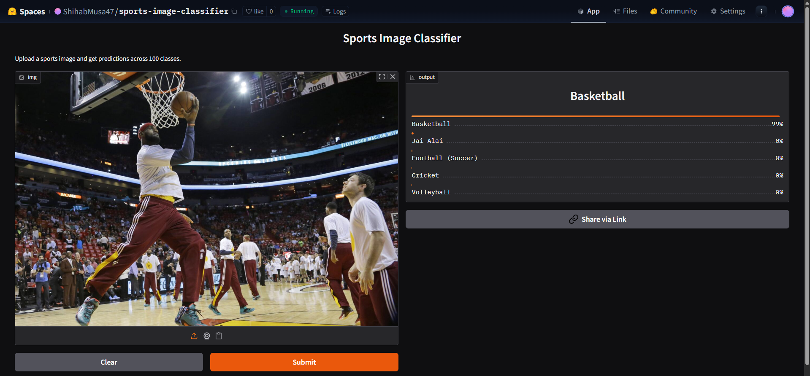

# 🏅 Sports Image Classifier
An end‑to‑end image classification project: from **data collection** and **cleaning**, to **model training**, **deployment**, and **API integration**.  
This model can classify **100 different types of sports** using a ResNet50 backbone.

---

## 🎯 Supported Sports
The classifier recognizes 100 sports including:
- Air Hockey  
- Archery  
- Axe Throwing  
- Baseball  
- Basketball  
- Cricket  
- Judo  
- Rugby  
- Swimming  
- Volleyball  
*(…and 90 more — full list in `index.md`)*

---

## 📂 Dataset Preparation
Data was collected automatically using the [bing-image-downloader](https://pypi.org/project/bing-image-downloader/) library.  
The notebook `sports_data_prep.ipynb` handles:
- Creating a `data/` folder if it doesn’t exist.  
- Iterating through all 100 sports labels.  
- Downloading ~50 images per sport with Bing Image Search.  
- Logging successes and failures with timestamps.  

This automated pipeline ensured a diverse dataset across all sports categories.

---

## 🛠️ Training and Data Cleaning
- **Training:** Fine‑tuned a ResNet50 model for multiple epochs, achieving strong accuracy of (82.86%) across 100 classes.  
- **Data Cleaning:** Since the dataset was collected from the web, noisy and mislabeled images were common. Fastai’s `ImageClassifierCleaner` was used iteratively after each training cycle to prune and correct the dataset.  
- **Final Model:** Produced the deployed weights (`resnet50_weights.pth`) after the last cleaning iteration.

---

## 🔄 Model Export
After training with Fastai, the model was exported into a clean PyTorch format for deployment.  
The script `export_weights.py` performs the following steps:
- Loads the Fastai learner (`resnet50_py310.pkl`).  
- Creates a fresh torchvision `resnet50` backbone.  
- Adjusts the final fully connected layer to match the number of classes (`len(learn.dls.vocab)`).  
- Copies weights from the Fastai model into the torchvision model.  
- Saves the clean weights as `resnet50_weights_clean.pth`.  

This ensures the deployed model is framework‑agnostic and can be loaded safely in environments without Fastai.

---

## 🚀 Deployment
The trained model is deployed to **Hugging Face Spaces** using a Gradio app.  
Implementation can be found in the `notebooks` folder or [here](https://huggingface.co/spaces/ShihabMusa47/sports-image-classifier).  

---

## 🌐 API Integration with GitHub Pages
The deployed model API is integrated into a GitHub Pages website for easy access.  
Implementation and other details can be found in the `docs` folder.  

👉 [Live GitHub Pages Site](https://shihab-musa47.github.io/100-sports-classifier-using-resnet50-/)

---

## 👨‍💻 Author
**Shihab Musa**  
B.Sc. in Computer Science and Engineering, BRAC University  
Focused on machine learning, applied data science, and reproducible deployments.
